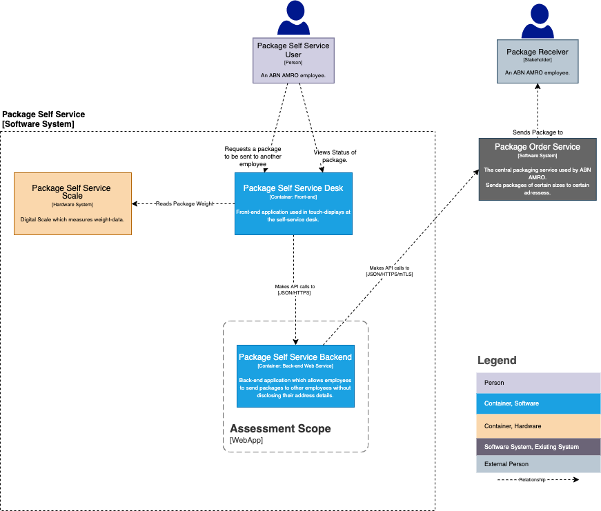

# Backend Developer Assessment | Team Sonic
___
## Introduction
The Backend Developer Assessment is intended to gauge your current knowledge in the back-end development space.  
You are asked to complete this assessment within five days.

As a general rule; quality over quantity, we would rather see you implement one endpoint in a production-like way,
than to see all endpoints implemented with only functionally valid code.

___
## Scenario
Some colleagues within __ABN AMRO__ bank would like to send packages to other employees.  
As disclosing address details to all employees within the bank raises privacy issues, ABN has decided that
packages should be sent from the __ABN AMRO__ office.

Normally this would be done by hand; the service desk at the local office would take the package, weigh it,
look up the employee's address details, print a label and prepare the package for sending.  
Lately the service-desk is being overrun with new responsibilities, which means they won't be able to do these manual tasks anymore.

__ABN AMRO__ decided to create a self-service desk for these packages instead. The __PackageSelfService__ machine's front-end
will be built by one of the existing teams, but this team has no knowledge of back-end development,
thus you were hired to build the __PackageSelfServiceBackEnd__!

### C4 Container Diagram

___
## Assignment
Create a Web Service with a REST API to be used by the __PackageSelfService__ front-end team.  
This Web Application should integrate with the __PackageShippingService__ which documentation
is provided in the [package-shipping-service.md](package-shipping-service.md) file.  
Use Spring Boot + Java.

### Functional Requirements:
The API needs to be able to do the following:
- List available receivers.  
  _For the sake of simplicity, you can hard-code a list of available users and their address details in your application._  

- Submit Package for sending using the following parameters:
  - Name of the package for future reference.
  - Weight of the package to be sent in grams.
  - Employee ID of the receiver.
  - Employee ID of the sender.
  
- List all the package-details for a sender using the following parameters:
  - Employee ID of the sender.
  - Optional status-type.

- List the details of an individual package.
  - Date of registration.
  - Package status.
  - Date of receipt (when status is DELIVERED)
  

### Non Functional Requirements:
The following non-functional requirements are also present:
- Provide OpenAPI/Swagger documentation for your service.
- Provide instructions on how to run your application locally.
- Use logging in order to make the service observable.
- Properly test your service. (at least unit testing)

- Not required, but a nice to have: Use Docker to containerise your service.

### In addition:

You're not expected to spend full days on this assessment, a few hours should be sufficient.
Because of this there might be things you would normally like to do/add, but can't because of time constraints,
please write those down with an explanation of how you would approach it differently in a real scenario. :) 

If there's any questions, feel free to reach out!
___

